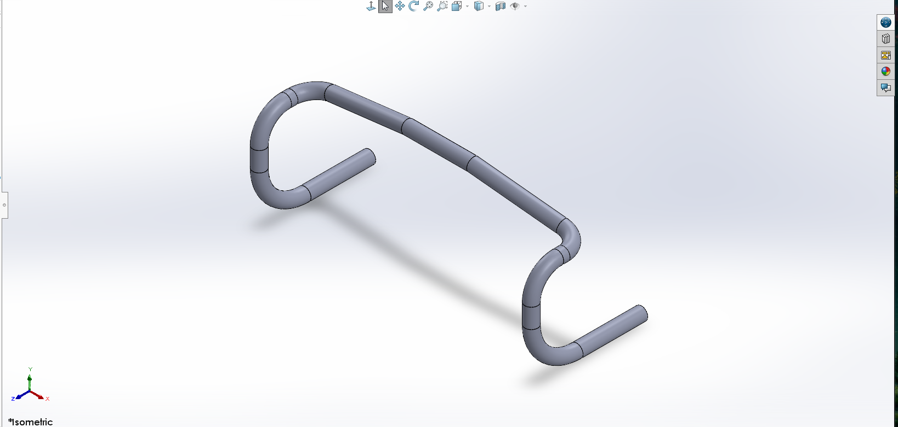
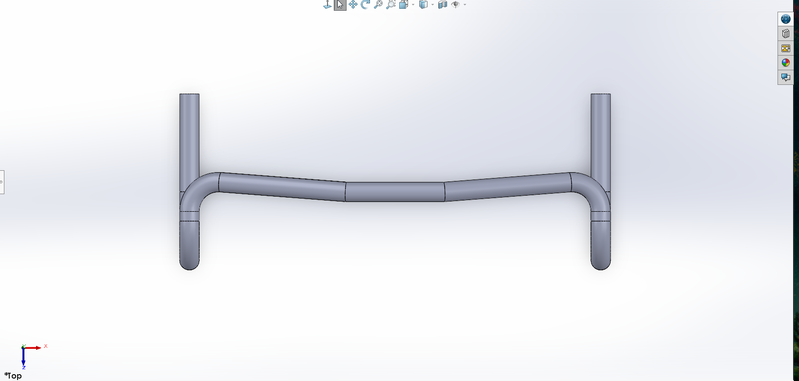
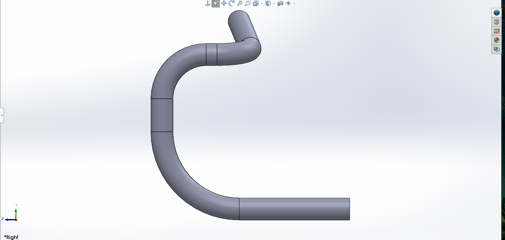

# Bicycle Handlebar – SolidWorks CAD

## Overview
This project models a bicycle handlebar using SolidWorks. The geometry was created using curved tubular sweeps to represent a realistic handlebar structure.

## Tools Used
- SolidWorks
- 3D Sketch
- Sweep Feature

## Isometric View

## Top View

## Side View

