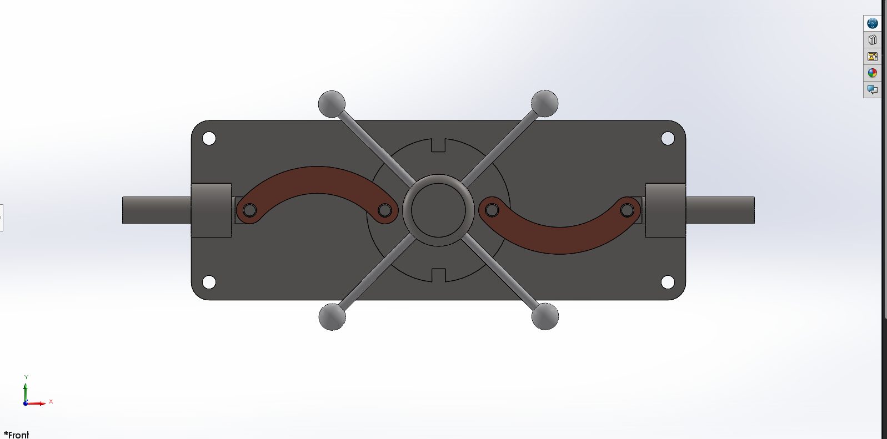
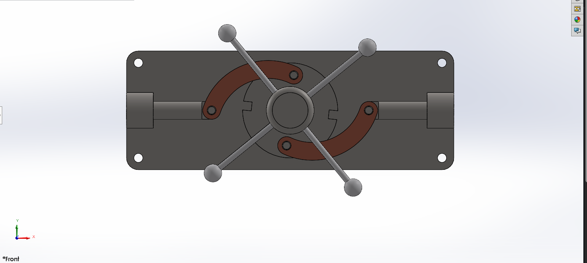

# Mechanical Lock Assembly – SolidWorks

## Overview
This project models a mechanical locking mechanism using a SolidWorks assembly.  
The design demonstrates how multiple components interact through mechanical mates to create a working locking and unlocking mechanism.

## Tools Used
- SolidWorks
- Assembly Design
- Mechanical Mates

## Isometric View

## Exploded Assembly

## Locked Position

## Unlocked Position

